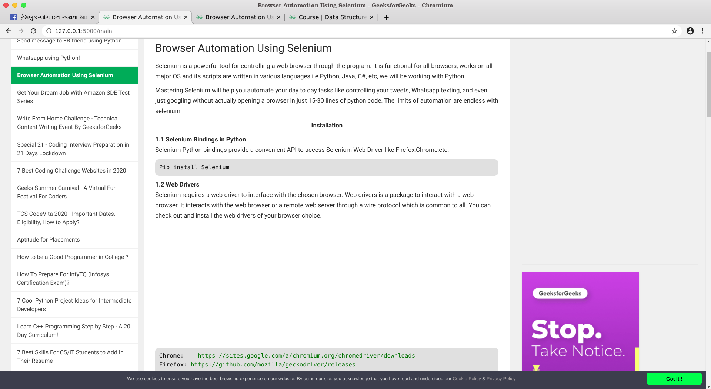

# Cloned-it 
A Flask based simple web browser which saves the content of a page for offline use and opens the links found on the same page and save their content.

## Status

Most basic of the version i want to implement, but still working on to nail it!

## Setting up

### Clone

    git clone https://github.com/Zaidtech/Cloned-it.git

It creates a new "Cloned-it" folder.

### Create Virtual Environment

 Create virtual environment in "Cloned-it" folder.

    For Windows:    virtualenv venv
    For Linux:      python3 -m venv venv

 Activate Virtual Environment

    For windows:  venv\Scripts\activate
    For linux:  source venv/bin/activate

### Install Requirements:

    pip3 install -r requirements.txt

### Run Project
  
    flask run

## Preview

On running up the `Flask-server` a window will appear like this

  

When i tried some url's ,it downloads a copy of the page and displays the copy of that webpages
Here are some results:-

1. Facebook

    

Facebook in Marathi language.
As it is able to dynamically load the translation links as well!!  .)

2. GeekForGeeks

 
